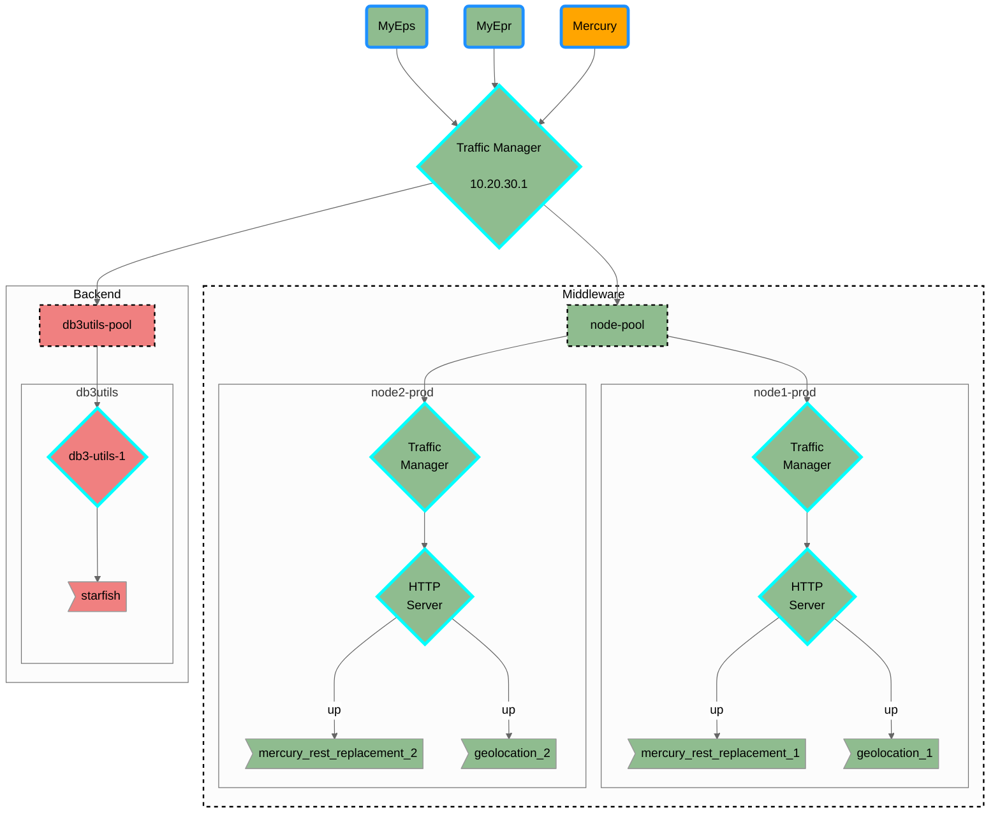

# whatsup
## Network Diagram 

```mermaid
%%{init: {'theme': 'neutral', "flowchart" : { "curve" : "basis" } } }%%
graph TD
 linkStyle default interpolate basis
 myeps(<center><a style='text-decoration:none' href='/main/applications/myeps/README.md'><span style='color:black'>MyEps</span></a></center>)-->tm
 myepr(<center><a style='text-decoration:none' href='/main/applications/myepr/README.md'><span style='color:black'>MyEpr</span></a></center>)-->tm
 mercury(<center><a style='text-decoration:none' href='/main/applications/mercury/README.md'><span style='color:black'>Mercury</span></a></center>)-->tm
 tm{<center>Traffic Manager<br><br>10.20.30.1</center>}
 subgraph mw[<center><a style='text-decoration:none' href='/main/applications/myeps/README.md'><span style='color:black'>Middleware</span></a></center>]
  node-pool
  subgraph node1-prod
    traefik-node1-prod{<center><a style='text-decoration:none' href='/main/applications/myeps/README.md'><span style='color:black'>Traffic<br/>Manager</span></a></center>}
    iis-node1-prod{<center><a style='text-decoration:none' href='/main/applications/myeps/README.md'><span style='color:black'>HTTP<br/>Server</span></a></center>}
    mercury-rest_1><center><a style='text-decoration:none' href='/main/applications/myeps/README.md'><span style='color:black'>mercury_rest_replacement_1</span></a></center>]
    geolocation_1><center><a style='text-decoration:none' href='/main/applications/myeps/README.md'><span style='color:black'>geolocation_1</span></a></center>]
  end
  subgraph node2-prod
    traefik-node2-prod{<center><a style='text-decoration:none' href='/main/applications/myeps/README.md'><span style='color:black'>Traffic<br/>Manager</span></a></center>}
    iis-node2-prod{<center><a style='text-decoration:none' href='/main/applications/myeps/README.md'><span style='color:black'>HTTP<br/>Server</span></a></center>}
    mercury-rest_2><center><a style='text-decoration:none' href='/main/applications/myeps/README.md'><span style='color:black'>mercury_rest_replacement_2</span></a></center>]
    geolocation_2><center><a style='text-decoration:none' href='/main/applications/myeps/README.md'><span style='color:black'>geolocation_2</span></a></center>]
  end
 end
 subgraph be[<center><a style='text-decoration:none' href='/main/applications/myeps/README.md'><span style='color:black'>Backend</span></a></center>]
  db3utils-pool
  subgraph db3utils
    db3-utils-1{<center><a style='text-decoration:none' href='/main/applications/myeps/README.md'><span style='color:black'>db3-utils-1</span></a></center>}
    starfish><center><a style='text-decoration:none' href='/main/applications/myeps/README.md'><span style='color:black'>starfish</span></a></center>]
  end
 end

 tm-->node-pool
 tm-->db3utils-pool
 db3utils-pool-->db3-utils-1
 db3-utils-1-->starfish
 node-pool-->traefik-node1-prod
 node-pool-->traefik-node2-prod
 traefik-node1-prod-->iis-node1-prod
 iis-node1-prod-->|up|mercury-rest_1
 iis-node1-prod-->|up|geolocation_1
 traefik-node2-prod-->iis-node2-prod
 iis-node2-prod-->|up|mercury-rest_2
 iis-node2-prod-->|up|geolocation_2

classDef up fill:darkseagreen
classDef issue fill:orange
classDef down fill:lightcoral

classDef app stroke:dodgerblue,stroke-width:4px
classDef group stroke:black,stroke-width:2px,stroke-dasharray: 5 5
classDef pool stroke:black,stroke-width:2px,stroke-dasharray: 5 5
classDef webserver stroke:cyan,stroke-width:4px
classDef dbserver stroke:cyan,stroke-width:4px
classDef tm stroke:cyan,stroke-width:4px

tm:::tm
traefik-node2-prod:::tm
traefik-node1-prod:::tm
mw:::group
myeps:::app
myepr:::app
mercury:::app
node-pool:::pool
db3utils-pool:::pool
iis-node1-prod:::webserver
iis-node2-prod:::webserver
db3-utils-1:::dbserver

traefik-node1-prod:::up
traefik-node2-prod:::up
iis-node1-prod:::up
iis-node2-prod:::up
myeps:::up
myepr:::up
mercury:::issue
tm:::up
node-pool:::up
mercury-rest_1:::up
mercury-rest_2:::up
geolocation_1:::up
geolocation_2:::up

db3utils-pool:::down
db3-utils-1:::down
starfish:::down

```
