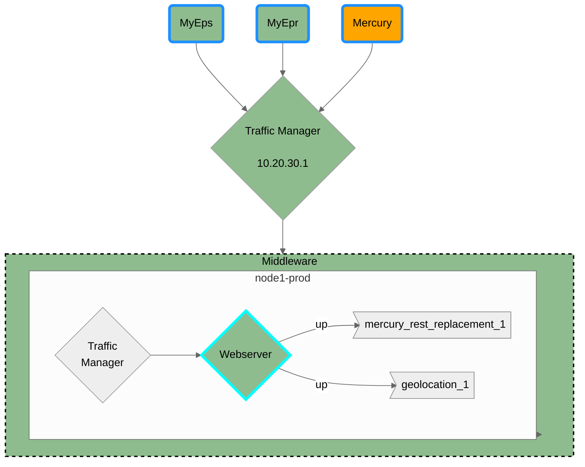

# whatsup
Whats Up test 

```mermaid
%%{init: {'theme': 'neutral', "flowchart" : { "curve" : "basis" } } }%%
graph TD
 linkStyle default interpolate basis
 myeps(<center><a style='text-decoration:none' href='https://github.com/EproductiveReleases/whatsup/blob/main/applications/myeps/README.md'><span style='color:black'>MyEps</span></a></center>)-->tm
 myepr(<center><a style='text-decoration:none' href='https://github.com/EproductiveReleases/whatsup/blob/main/applications/myepr/README.md'><span style='color:black'>MyEpr</span></a></center>)-->tm
 mercury(<center><a style='text-decoration:none' href='https://github.com/EproductiveReleases/whatsup/blob/main/applications/mercury/README.md'><span style='color:black'>Mercury</span></a></center>)-->tm
 tm{<center>Traffic Manager<br><br>10.20.30.1</center>}
 subgraph node-pool[<center><a style='text-decoration:none' href='https://github.com/EproductiveReleases/whatsup/blob/main/applications/myeps/README.md'><span style='color:black'>Middleware</span></a></center>]
  subgraph node1-prod
    traefik-node1-prod{<center><a style='text-decoration:none' href='https://github.com/EproductiveReleases/whatsup/blob/main/applications/myeps/README.md'><span style='color:black'>Traffic<br/>Manager</span></a></center>}
    iis-node1-prod{<center><a style='text-decoration:none' href='https://github.com/EproductiveReleases/whatsup/blob/main/applications/myeps/README.md'><span style='color:black'>Webserver</span></a></center>}
    mercury-rest_1><center><a style='text-decoration:none' href='https://github.com/EproductiveReleases/whatsup/blob/main/applications/myeps/README.md'><span style='color:black'>mercury_rest_replacement_1</span></a></center>]
    geolocation_1><center><a style='text-decoration:none' href='https://github.com/EproductiveReleases/whatsup/blob/main/applications/myeps/README.md'><span style='color:black'>geolocation_1</span></a></center>]
  end
 end

 tm-->node-pool
 node-pool-->node1-prod
 traefik-node1-prod-->iis-node1-prod
 iis-node1-prod-->|up|mercury-rest_1
 iis-node1-prod-->|up|geolocation_1

classDef up fill:darkseagreen
classDef issue fill:orange
classDef down fill:orangered

classDef app stroke:dodgerblue,stroke-width:4px
classDef pool stroke:black,stroke-width:2px,stroke-dasharray: 5 5
classDef webserver stroke:cyan,stroke-width:4px

myeps:::app
myepr:::app
mercury:::app
node-pool:::pool
iis-node1-prod:::webserver

iis-node1-prod:::up
myeps:::up
myepr:::up
mercury:::issue
tm:::up
node-pool:::up


```
