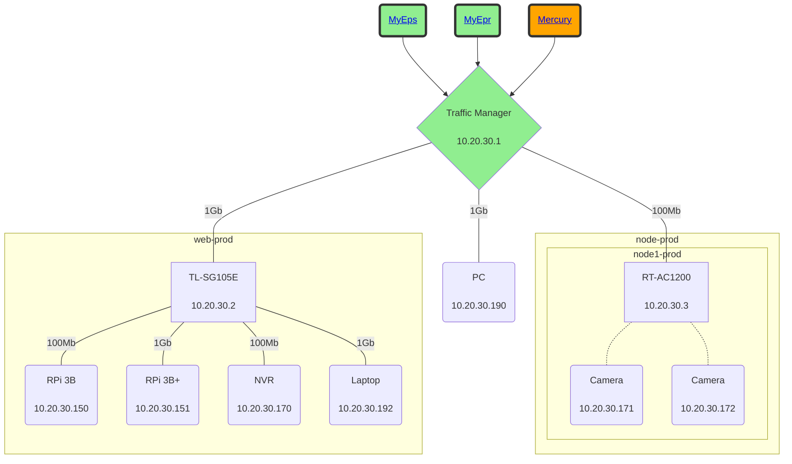

# whatsup
Whats Up test 

```mermaid
graph TD
 linkStyle default interpolate basis
 myeps(<center><a href='https://github.com/EproductiveReleases/whatsup/blob/main/applications/myeps/README.md'>MyEps</a></center>)-->tm
 myepr(<center><a href='https://github.com/EproductiveReleases/whatsup/blob/main/applications/myepr/README.md'>MyEpr</a></center>)-->tm
 mercury(<center><a href='https://github.com/EproductiveReleases/whatsup/blob/main/applications/mercury/README.md'>Mercury</a></center>)-->tm
 tm{<center>Traffic Manager<br><br>10.20.30.1</center>}
 tm---|100Mb|ap[<center>RT-AC1200<br><br>10.20.30.3</center>]
 tm---|1Gb|pc(<center>PC<br><br>10.20.30.190</center>)
 tm---|1Gb|switch[<center>TL-SG105E<br><br>10.20.30.2</center>]
 subgraph node-prod
  subgraph node1-prod
  ap-.-cam1(<center>Camera<br><br>10.20.30.171</center>)
  ap-.-cam2(<center>Camera<br><br>10.20.30.172</center>)
  end
 end
 subgraph web-prod
 switch---|100Mb|pi1(<center>RPi 3B<br><br>10.20.30.150</center>)
 switch---|1Gb|pi2(<center>RPi 3B+<br><br>10.20.30.151</center>)
 switch---|100Mb|nvr(<center>NVR<br><br>10.20.30.170</center>)
 switch---|1Gb|laptop(<center>Laptop<br><br>10.20.30.192</center>)
 end

style myeps fill:lightgreen,stroke:#333,stroke-width:4px
style myepr fill:lightgreen,stroke:#333,stroke-width:4px
style mercury fill:orange,stroke:#333,stroke-width:4px
style tm fill:lightgreen

```
